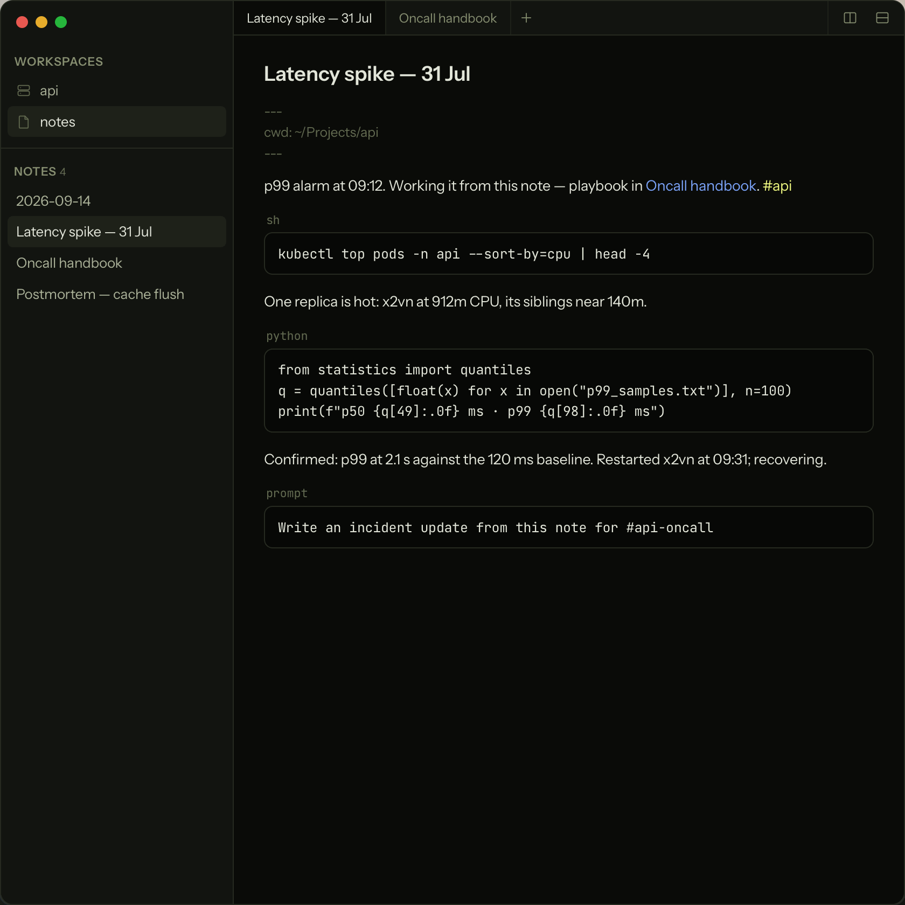
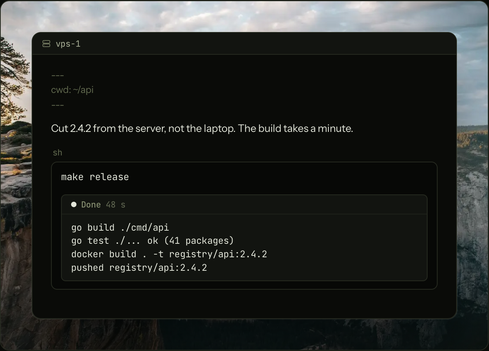
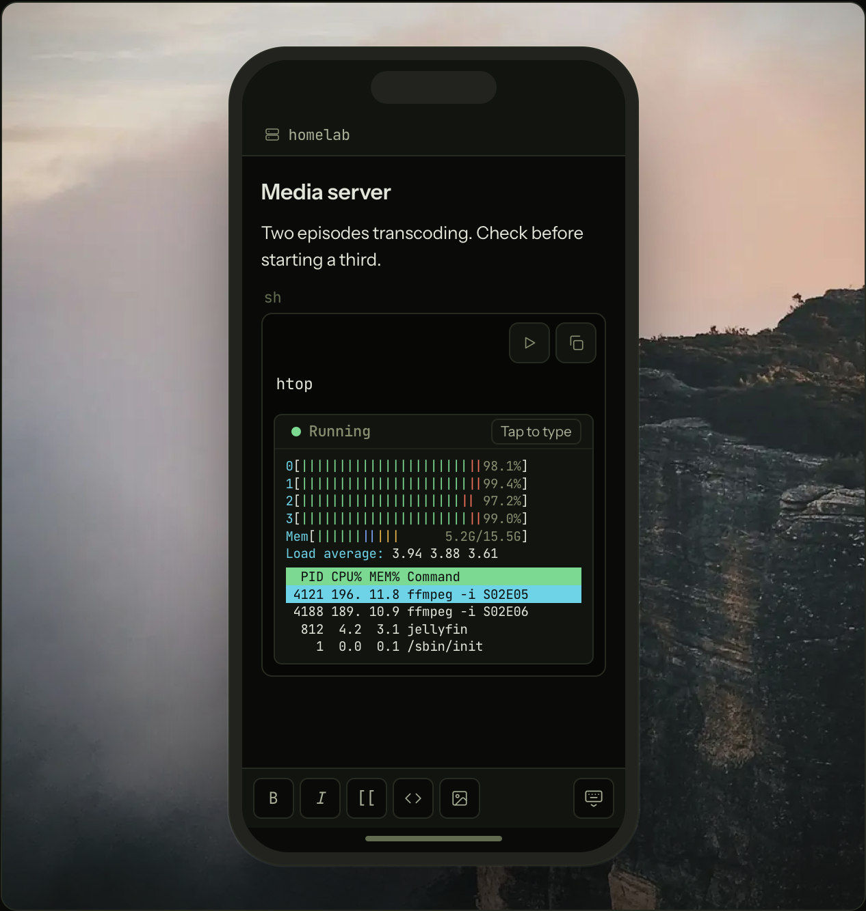

<p align="center">
  <picture>
    <source media="(prefers-color-scheme: dark)" srcset="assets/readme/logo-dark.svg">
    
  </picture>
</p>

<h1 align="center">Ledge</h1>

<p align="center">The notebook that runs code.<br>Markdown notes for developers and DevOps, on macOS and iPhone.</p>

<p align="center">
  <a href="https://ledge.sh">Website</a> ·
  <a href="https://ledge.sh/docs">Documentation</a> ·
  <a href="https://github.com/ledgesh/ledge/releases/latest">Download</a>
</p>

<p align="center">
  <a href="https://github.com/ledgesh/ledge/actions/workflows/ci.yml"></a>
  <a href="LICENSE"></a>
</p>

<p align="center">
  
</p>

Ledge is a Markdown notebook that runs the code in your notes. Press ⌘↩ on a
fenced block and its output streams in beneath it: shell commands, Python,
Node, Ruby, PHP, and TypeScript out of the box, SQL and Redis against the
database the note points at, and `prompt` blocks that send their text to an
AI agent.

Notes are plain `.md` files in folders you choose. They can live on your Mac,
or on a Linux or Mac server you reach over ssh, and the same notes open on
your iPhone or iPad. There is no account, no service, and no database on the
side.

## Install

**Mac.** Download the DMG from the
[latest release](https://github.com/ledgesh/ledge/releases/latest) and drag
Ledge to Applications. Ledge runs on macOS 13 or newer on Apple Silicon, and
updates itself.

**iPhone and iPad.** Get
[Ledge for iPhone](https://apps.apple.com/app/ledge-notebook/id6813315782) on the App
Store. It holds no notes of its own: it connects over ssh to a Linux server or
to your Mac, and reads, edits, and runs the same notes from anywhere.

**Server.** Host your notes on a Linux server or a Mac, run their blocks
there, and reach them from every device over ssh. Signed in as the account
Ledge should use:

```sh
curl -fsSL https://ledge.sh/server.sh | sh
```

Then `ledge pair` prints a pairing code to scan from the phone or paste into
the Mac app, and `ledge backup` keeps an encrypted copy of the notes in any
S3-compatible bucket. See
[Keep Notes on a Remote Server](https://ledge.sh/docs/keep-notes-on-a-remote-server)
and the [server tutorial](https://ledge.sh/docs/tutorial-set-up-a-ledge-server).

**CLI and agents.** Run "Install Shell Command (ledge)" from the command
palette (⇧⌘P). The `ledge` command then lists, reads, searches, creates, and
appends to notes from any terminal, and the app follows along live
([The ledge CLI](https://ledge.sh/docs/the-ledge-cli)). The same
command serves Ledge's MCP server, so one line connects Claude Code or any
other MCP agent:

```sh
claude mcp add ledge -- ledge mcp
```

## What Ledge does

- **Runs code blocks in place.** ⌘↩ runs the block under the caret and its
  output streams in beneath it. ⇧⌘↩ sends it to the note's terminal drawer
  instead. A running block takes input, so a `sudo` prompt or a `[y/N]` gets
  answered in the output panel. `sh`, `python`, `node`, `ruby`, `php`, and
  `ts` run out of the box, and adding an interpreter is one line in Settings.
  [Running Code](https://ledge.sh/docs/running-code)
- **Gives each note its own shell.** A `cd`, an exported variable, or an
  activated virtualenv carries into the next run. `cwd:` and `env:` in the
  frontmatter set where the note's shells start, or attach a project folder
  as a workspace and its Markdown files run in the project.
  [Frontmatter and Environments](https://ledge.sh/docs/frontmatter-and-environments)
- **Runs blocks on other machines.** A `host:` line in the frontmatter sends
  every run in the note over ssh to that host while the note stays put. Mark
  a block `confirm` and Ledge names the machine and asks first.
  [Run Code on Remote Hosts](https://ledge.sh/docs/run-code-on-remote-hosts)
- **Keeps notes on a server.** Point Ledge at a machine and the notes live
  there: the server holds the files and runs the shells, and the app is the
  window onto it. Running blocks survive a dropped connection, and your Mac,
  your phone, and a second window can all be on one server at once.
  [Keep Notes on a Remote Server](https://ledge.sh/docs/keep-notes-on-a-remote-server)
- **Works on your phone.** Pair the iOS app with a server by scanning a
  code. Tap Run on a block and it runs on the server, and keeps running when
  you switch apps.
  [Ledge on Your Phone](https://ledge.sh/docs/ledge-on-your-phone)
- **Keeps secrets out of notes.** A profile is a dotenv file kept outside the
  notes folder. `profile: deploy` in the frontmatter loads it into the note's
  shells, and the note carries only the name.
  [Profiles and Secrets](https://ledge.sh/docs/profiles-and-secrets)
- **Is built to be worked by agents.** Notes are addressed by title, a
  terminal opened inside a note knows which note it is in, and a `prompt`
  fence pipes its text to `claude -p` with ⌘↩. There is no delete tool.
  [Agents and Ledge](https://ledge.sh/docs/agents-and-ledge)
- **Locks the notes that matter.** Locking encrypts a note's body on disk
  behind a passphrase. Agents, search, and sync services see ciphertext
  until you unlock, and images pasted into a locked note are sealed with it.
  [Note Locking](https://ledge.sh/docs/note-locking)
- **Is a notes app underneath.** Live preview, `[[wikilinks]]` by title,
  backlinks, tags, full-text search, daily notes and templates, split panes
  with tabs, paste from the web as Markdown, and a trash with undo.
  [Getting Started](https://ledge.sh/docs)
- **Syncs with anything.** Notes are files in a folder, so iCloud Drive,
  Dropbox, Syncthing, or a git remote sync them, and Ledge follows outside
  changes live, even in an open note.
  [Keep Notes Synced](https://ledge.sh/docs/tutorial-keep-notes-synced)

<p align="center">
  
  
</p>

## Documentation

The manual is at [ledge.sh/docs](https://ledge.sh/docs). The same pages ship
inside the app: choose Documentation from the Help menu or the command
palette. Their source is [docs/user/](docs/user), and the pages from
[16](docs/user/16-tutorial-run-a-project.md) onward are tutorials that combine
the features into working routines.

[docs/contributor/](docs/contributor) describes how Ledge is built, from the
process and trust boundaries in
[architecture.md](docs/contributor/architecture.md) to the ssh protocol in
[remote.md](docs/contributor/remote.md) and the iOS client in
[ios.md](docs/contributor/ios.md).

## Build from source

Ledge is built on [Electrobun](https://electrobun.dev): a Bun process owns
the files and the shells, and a React app with a CodeMirror editor runs in
the system WebView. The same Bun code, without the window, is the
`ledge-server` package, and the iOS app is a Swift shell around the same
React view.

You need a Mac, [Bun](https://bun.sh), and Xcode.

```sh
bun install
bun run dev
```

The first launch downloads the Electrobun core and assembles `Ledge.app` under
`build/`.

```sh
bunx tsc --noEmit     # typecheck
bunx vite build       # build the view
bun test              # unit and filesystem tests
bun run test:e2e      # UI behavior in headless WebKit
```

[CONTRIBUTING.md](CONTRIBUTING.md) covers what "done" means here, how to send
a change, and which standard in `docs/contributor/` governs it.

## License

[Apache License 2.0](LICENSE). Copyright 2026 Dan Stevens.
